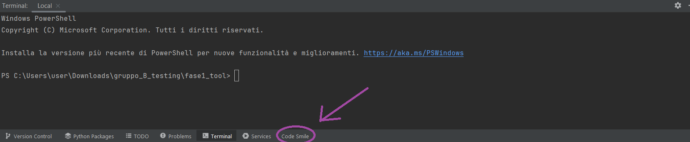

# 🧠 CodeSmile – A Code Smell Detection Tool for ML-enabled Systems

CodeSmile is a plugin and CLI tool for detecting **Machine Learning-specific code smells (ML-CSs)** in Python projects.  
It statically analyzes code to identify implementation patterns that may lead to performance, maintainability or correctness issues in ML pipelines.

> This project is the outcome of a research-based internship and thesis project at the University of Salerno.

---

## 🚀 Features

- ✅ Detection of ML-specific code smells (based on research literature)
- ✅ CLI-based and REST API execution
- ✅ IDE integration-ready (for JetBrains PyCharm)
- ✅ Real-time analysis support
- ✅ JSON and CSV output for integration & visualization

---

## 📦 Prerequisites

Before installing or running CodeSmile, make sure you have the following:

### 🐍 Python Environment
- Python **3.12.x** is required
- If you don't have, you can download at https://www.python.org/downloads/release/python-3120/ 

### 💡 IntelliJ IDEA Setup (for plugin mode)
If you're using CodeSmile via IntelliJ as a plugin, make sure the following plugins are installed:

- ✅ **Python** plugin  
- ✅ **Gradle** (usually bundled with IntelliJ)  
- ✅ **Plugin DevKit**

You can install these from **Settings → Plugins**, then search and enable them.

> ℹ️ CodeSmile has been tested primarily with **IntelliJ IDEA Community Edition 2023.3+** and **PyCharm 2023+**.

---

## 🎛️ Detection Modes

CodeSmile offers four detection modes, depending on your workflow or use case:

- 📄 **Single File Detection** – Analyze a specific Python file
- 🗂️ **Multiple Files Detection** – Analyze a selected set of files in a batch
- 🏗️ **Full Project Detection** – Scan an entire directory/project recursively
- ⚡ **Real-Time Detection** – Live detection during coding via the IDE plugin (PyCharm)

---

## 🔍 Supported Code Smells

CodeSmile currently detects the following ML-CSs:

- Chain Indexing  
- DataFrame Conversion API Misused  
- Columns and Dtype Not Explicitly Set
- Gradients Not Cleared Before Backward Propagation
- Matrix Multiplication API Misused  
- Merge API Parameter Not Explicitly Set  
- In-Place APIs Misused  
- NaN Equivalence Comparison Misused  
- Memory Not Freed Before Backward Propagation (TensorFlow)  
- PyTorch `forward()` Method Misused  
- TensorArray Not Used
- Unnecessary Iteration (non-vectorized Pandas usage)

---

## 🛠 Installation

1. Clone the repository:

```bash
git clone https://github.com/Daniy2/CodeSmile.git
cd CodeSmile
```

2. (Optional) Create a virtual environment:

```bash
python -m venv .venv
source .venv/bin/activate  # on Windows: .venv\Scripts\activate
```

3. Install dependencies:

```bash
pip install -r requirements.txt
```

---

## ⚙️ Usage 

### 🧪 Running the Plugin from IntelliJ (Gradle)

To launch CodeSmile as a JetBrains plugin:

1. Make sure your `Gradle` task is configured to run `runIde`
2. Set the environment variable `PROJECT_ROOT` to your project root (usually auto-filled)
3. You can use the provided run configuration file, or set it up manually like this:


Once configured, hit ▶️ **Run Plugin** to launch the IDE with the plugin installed.

### 📂 Run the plugin on your project

## ❗ Troubleshooting – Common Issues with Gradle and IntelliJ Plugin

Sometimes, IntelliJ Plugin tasks like `runIde` may fail due to Gradle caching or class loader errors.
Here are some quick solutions:

### ❌ Error Example
```
Class 'org.jetbrains.intellij.tasks.InitializeIntelliJPluginTask' not found
```
or
```
Could not load the value of field `jvmArgumentProviders`
```

### ✅ Solution Steps

1. **Close IntelliJ completely**
2. **Clean the project and Gradle cache**:
   ```bash
   ./gradlew clean --refresh-dependencies
   ```
3. **Delete Gradle caches and temp resolver files manually** (Windows):
   - `C:\Users\<user>\AppData\Local\Temp\ijresolvers*.gradle`
   - `C:\Users\<user>\.gradle\caches`
4. **Verify JDK version** (e.g., Java 17+ is recommended)
5. **Ensure Gradle and plugin versions are compatible**:
   - Gradle 8.x
   - IntelliJ Plugin `org.jetbrains.intellij` version `1.13.3` or newer

6. Restart IntelliJ and try again:
   ```bash
   ./gradlew runIde
   ```

> 💡 If the issue persists, run with `--stacktrace` to see detailed logs and open an issue.


1. Open your projects in the IDE
2. Click the tool window menu in Pycharm called "Code Smile" (to help you to search, see the photo below)
3. Select the detection modes you prefer and enjoy


